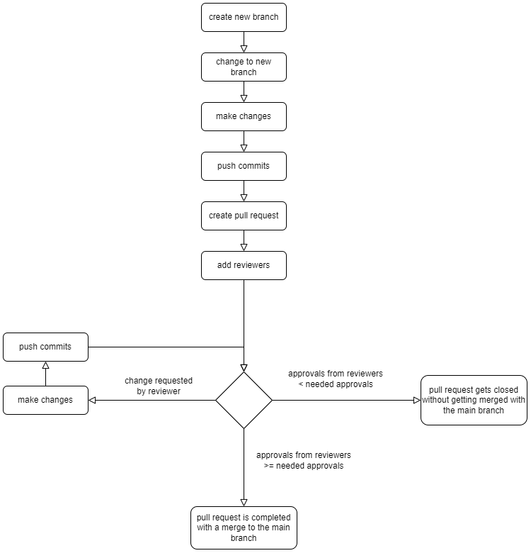
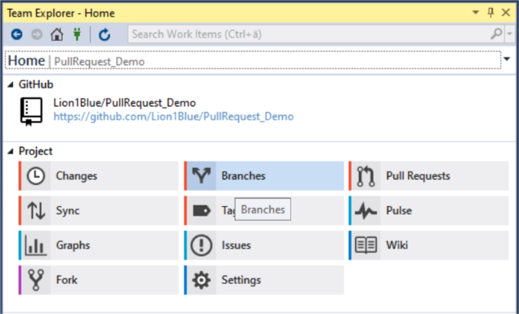
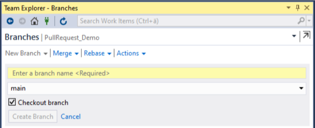
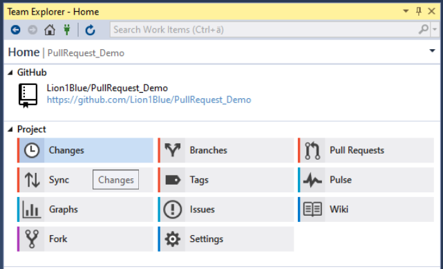
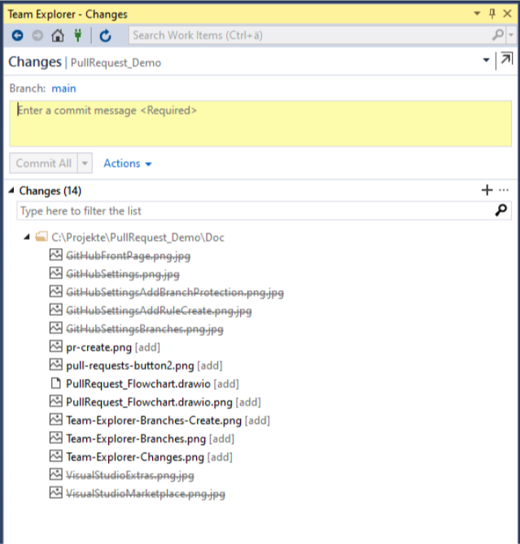
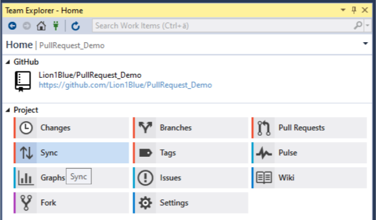
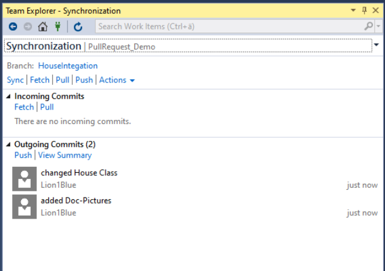
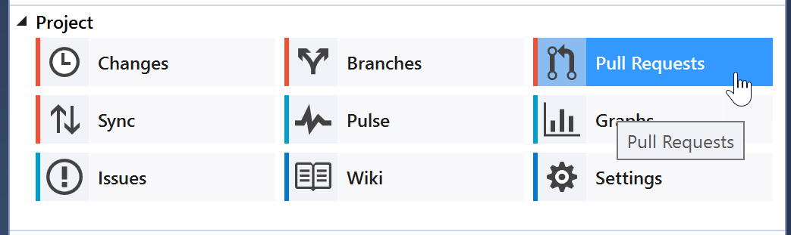
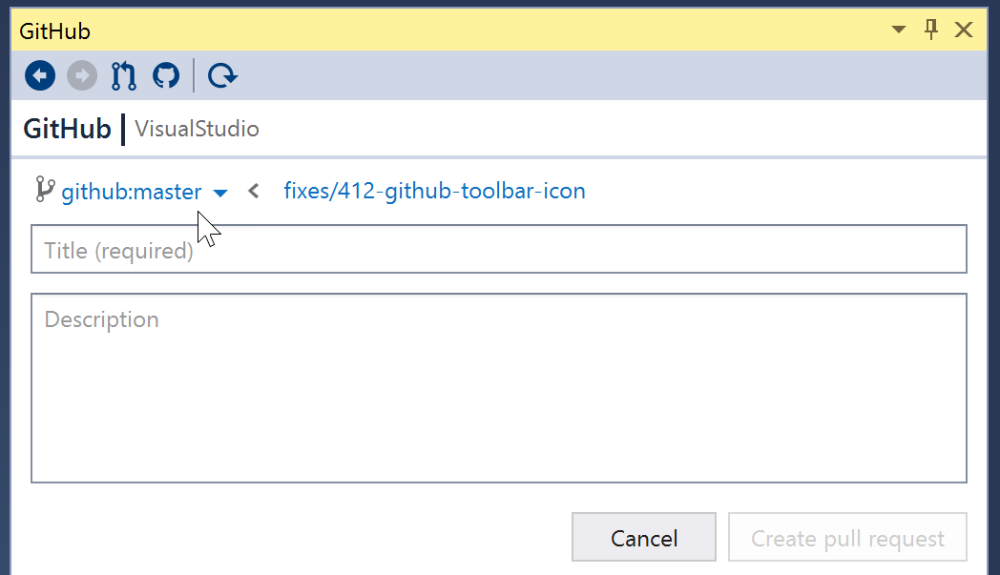

# Pull Request in Visual Studio

## Preconditions

GitHub Visual Studio Extension installed. Here is a quick [Guide](https://github.com/github/VisualStudio/blob/master/docs/getting-started/installing-github-for-visual-studio.md) on how to install the Extension.

The following [Tutorial](https://github.blog/2018-03-23-require-multiple-reviewers/#:~:text=To%20require%20multiple%20reviewers%20for,pull%20request%20to%20that%20branch.) will show how to activate brach protection, so that the pull request can only be merged when a certain number of reviewers gave their approval for the pull request.

## Pull Request Workflow

  

 

### Create a new Branch in Visual Studio

1. Open **Team Explorer** and click the **Branches** Button.   

2. Click the **New Branch** link.
3. In the "Enter a Branch Name Required" dialog box, enter a branch name.   

4. In the Based on section, use the drop-down list to choose whether you want to base your new branch off an existing branch.
5. The Checkout branch checkbox, which is on by default, automatically switches to the newly created branch. Toggle this option if you want to remain in the current branch.
6. Click the **Create** Button to create a new branch

 

### Create Commit to local Repository

1. Make changes in the source code.
2. Open **Team Explorer** and click the **Changes** Button.   

3. Here all changes that haven't been commited are listed.   

4. In the "Enter a commit Message" dialog box, enter a commit message.   
5. Click the **Commit All** Button to create a local commit.   

 

### Sync Commits with remote Repository

1. Open **Team Explorer** and click the **Sync** Button.   

2. Here all commits that haven't been pushed are listed.

3. To sync your local Repository with the remote repository Click the **Push** link under "Outgoing Commits"

 

### Create a Pull Request in Visual Studio

1. Open a project in a GitHub repository.
2. Open **Team Explorer** and click the **Pull Requests** button to open the **GitHub** pane.

3. Click the **Create New** link above the list of pull requests for the repository.
4. Select the target branch by clicking the link.

5. Enter a pull request title and an optional description.
6. Click the **Create Pull Request** button.

 

### Approval from Reviewer

 

### Change Request from Reviewer

 

### Close Pull Request without merging with main-Branch

 

### Merge Pull Request with main-Branch

## [Reviewing a Pull Request in Visual Studio](https://github.com/github/VisualStudio/blob/master/docs/using/reviewing-a-pull-request-in-visual-studio.md)

## [Adding Reviewer to Pull Request in GitHub](https://docs.github.com/en/pull-requests/collaborating-with-pull-requests/proposing-changes-to-your-work-with-pull-requests/requesting-a-pull-request-review)

## [Merging a Pull Request in GitHub](https://docs.github.com/en/pull-requests/collaborating-with-pull-requests/incorporating-changes-from-a-pull-request/merging-a-pull-request)
